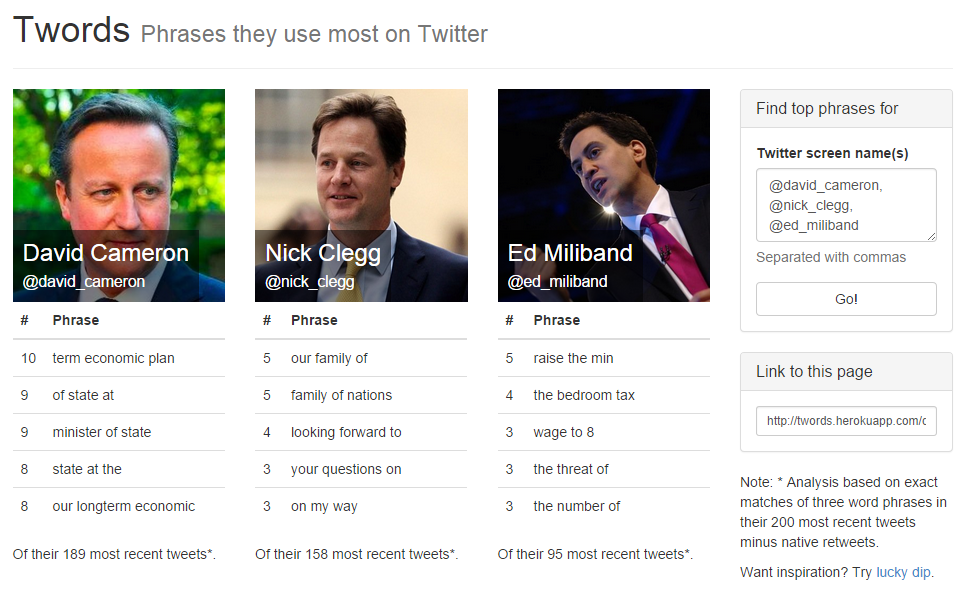

# Twords - top phrases in tweets

[Twords](http://twords.herokuapp.com) is a web app that identifies the most common three word phrases in a Twitter user's recent tweets. It works for groups of users as well.

Here's an [example using British politicians](http://twords.herokuapp.com/david_cameron+nick_clegg+ed_miliband):

Made for fun by [@robjones](http://twitter.com/robjones) using [Flask](http://flask.pocoo.org), [Bootstrap](http://getbootstrap.com) and the [Twitter API](https://dev.twitter.com).

Copyright © 2014 Rob Jones. All rights reserved.